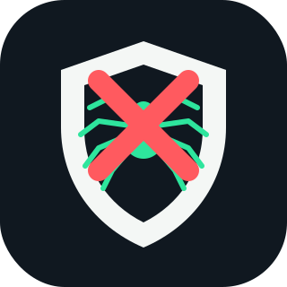

<p align="center">
  
</p>

<h1 align="center">NoSkrap</h1>

<p align="center">
   <strong>TypeScript bot-risk framework for Next.js apps.</strong><br>
   <em>NoSkrap scores each request with coherent, explainable signals: headers, fetch metadata, visitor continuity, and route velocity. It returns one decision per request: `allow`, `observe`, `challenge`, or `block`.</em>
</p>

## Install

```bash
bun add noskrap
```

## Quickstart

```ts
// proxy.ts
import { createNoSkrapProxy } from "noskrap/next";

export const config = {
  matcher: ["/((?!_next/static|_next/image|favicon.ico|robots.txt|sitemap.xml).*)"],
};

export default createNoSkrapProxy({
  secret: process.env.NOSKRAP_SECRET!,
  protectedRoutes: ["/api/search", "/login", "/checkout"],
});
```

Default mode is `observe`, so NoSkrap scores and sets a signed visitor cookie without blocking traffic.

## Enforce mode

```ts
import { createNoSkrapProxy } from "noskrap/next";

export default createNoSkrapProxy({
  secret: process.env.NOSKRAP_SECRET!,
  mode: "enforce",
  protectedRoutes: ["/api/search", "/login", "/checkout"],
  challengePath: "/bot-check",
});
```

In enforce mode, `block` returns `403`. `challenge` redirects to `challengePath` when configured.

## Route handlers

```ts
import { getNoSkrapDecision } from "noskrap/next";

export async function POST(request: Request) {
  const result = await getNoSkrapDecision(request, {
    secret: process.env.NOSKRAP_SECRET!,
    protectedRoutes: ["/api/search"],
  });

  if (result.decision === "block") {
    return Response.json({ error: "blocked" }, { status: 403 });
  }

  return Response.json({
    decision: result.decision,
    score: result.score,
    reasons: result.reasons,
  });
}
```

## Core API

```ts
import { MemoryBotStorage, scoreRequest } from "noskrap/core";

const result = await scoreRequest(request, {
  secret: process.env.NOSKRAP_SECRET!,
  storage: new MemoryBotStorage(),
  protectedRoutes: ["/api/search"],
});

console.log(result.decision, result.score, result.reasons);
```

Decisions use these default score bands:

| Score | Decision |
| ---: | --- |
| 0-29 | `allow` |
| 30-59 | `observe` |
| 60-84 | `challenge` |
| 85+ | `block` |

## Signals

NoSkrap MVP checks:

- missing normal browser headers on HTML navigation
- automation user-agent tokens such as `HeadlessChrome` or `curl`
- user-agent and Client Hints platform mismatch
- weak fetch metadata on protected state-changing requests
- missing visitor cookie continuity on protected routes
- protected state-changing requests without recent interaction telemetry
- route burst rate per visitor and IP bucket

Each score contribution includes a stable `ruleId` and score.

## Telemetry

Add a route handler:

```ts
// app/api/noskrap/telemetry/route.ts
import { createNoSkrapTelemetryHandler } from "noskrap/next";

export const POST = createNoSkrapTelemetryHandler({
  secret: process.env.NOSKRAP_SECRET!,
});
```

Send coarse interaction state from your app:

```ts
fetch("/api/noskrap/telemetry", {
  method: "POST",
  body: JSON.stringify({ pageView: true, interacted: true }),
});
```

NoSkrap stores only coarse timestamps for page view and interaction state.

## Bot detected popup

```ts
import { showBotDetectedPopup } from "noskrap/client";

showBotDetectedPopup(result);
```

By default, this shows `"Bot detected."` for `challenge` and `block` decisions.

## Config

```ts
interface NoSkrapConfig {
  secret: string | string[];
  mode?: "observe" | "enforce";
  protectedRoutes?: string[];
  challengePath?: string;
  trustedProxies?: string[];
  storage?: BotStorage;
  thresholds?: {
    observe: number;
    challenge: number;
    block: number;
  };
  rules?: RuleConfig[];
}
```

Rules can be disabled or rescored:

```ts
createNoSkrapProxy({
  secret: process.env.NOSKRAP_SECRET!,
  rules: [
    { id: "browser.automationUa", score: 20 },
    { id: "headers.uaClientHintsMismatch", enabled: false },
  ],
});
```

## Security notes

- Visitor cookies are HMAC signed.
- Cookie defaults are `HttpOnly`, `Secure`, `SameSite=Lax`, and `Path=/`.
- Raw secrets, full cookies, and raw challenge tokens should not be logged.
- Default storage is in-memory and process-local; use a production adapter when one exists.
- NoSkrap is risk scoring, not guaranteed bot blocking.

## Development

```bash
bun install
bun run check
```
