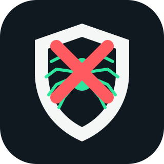

<p align="center">
  
</p>

<h1 align="center">NoSkrap</h1>

<p align="center">
  <strong>Score bot risk in your Next.js app, and see why each score happened.</strong><br>
  <em>Request signals, signed visitor continuity, route velocity, interaction telemetry, and challenge passes.</em>
</p>

<p align="center">
  <a href="https://www.typescriptlang.org"></a>
  <a href="https://nextjs.org"></a>
  <a href="https://bun.sh"></a>
  <a href="https://github.com/kacigaya/noskrap/blob/main/LICENSE"></a>
</p>

## Install

```bash
bun add noskrap
```

## Quickstart

```ts
// proxy.ts
import { createNoSkrapProxy } from "noskrap/next";

export const config = {
  matcher: ["/((?!_next/static|_next/image|favicon.ico|robots.txt|sitemap.xml).*)"],
};

export const proxy = createNoSkrapProxy({
  secret: process.env.NOSKRAP_SECRET!,
  protectedRoutes: ["/api/search", "/login", "/checkout"],
});
```

## Documentation

- [Quickstart](https://kacigaya.github.io/noskrap/docs/getting-started/quickstart/)
- [Next Proxy](https://kacigaya.github.io/noskrap/docs/user-guide/next-proxy/)
- [Route Handlers](https://kacigaya.github.io/noskrap/docs/user-guide/route-handlers/)
- [Telemetry](https://kacigaya.github.io/noskrap/docs/user-guide/telemetry/)
- [Challenge Pass](https://kacigaya.github.io/noskrap/docs/user-guide/challenge-pass/)
- [API Reference](https://kacigaya.github.io/noskrap/docs/api-reference/)
- [Development](https://kacigaya.github.io/noskrap/docs/development/)
